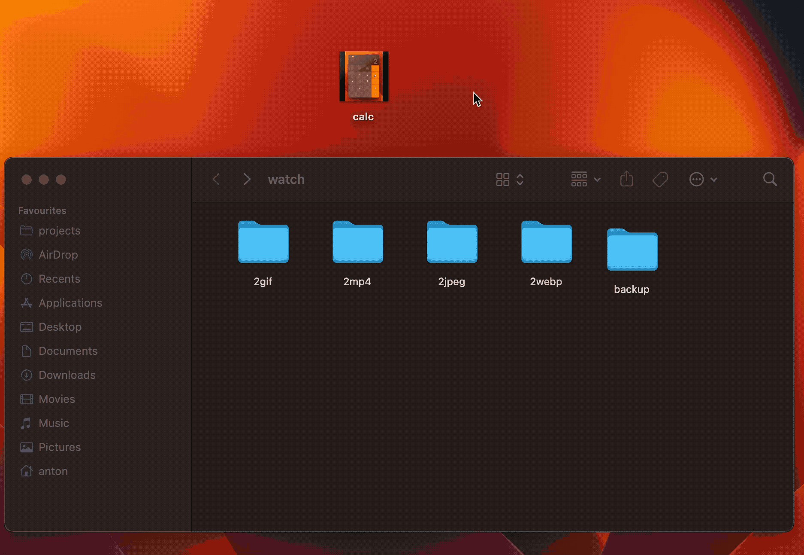

# Magic Hat

Fast assets converter for your tutorials.


# Using

- [ ] Install dependencies:

```bash
brew install imagemagick
brew install ffmpeg
npm ci
```

- [ ] Run application:

```bash
npx gulp
```

- [ ] Move source file to any target folder:



- [ ] Run web server if your need:

```bash
npm start
open http://localhost:3000
```